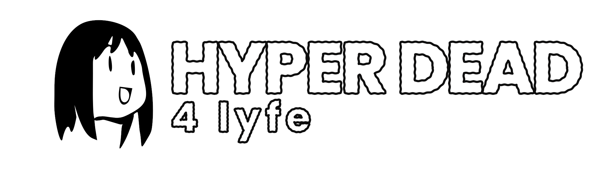

<p align="center"></p>

# Hyper Dead 4 Lyfe

Hyper Dead 4 Lyfe is a Left 4 Dead 2 gameplay overhaul written in VScript.
It runs as five separate game modes, so vanilla coop, versus and the other
mutations are left alone.

At its core is a movement kit for survivors: dash, slide, double jump, wall
run and flying kicks, all on one stamina bar. A player who dies carries on as
one of the bots, every special infected gets an attack of its own, and the
director keeps raising the pressure over the campaign.

Fort turns survival into a building game. Between waves, players break the
map down into scrap and spend it on walls, stairs, traps and mounted guns,
then hold the fort as each wave comes in longer and harder, with tanks from
wave 4. Pieces stack freely, so a fort can be anything from a sandbag ring to
a multi-storey tower of stairs and roofs with a minigun on top.

| mode | what |
|---|---|
| `hd4l` | the campaign, coop |
| `hd4lversus` | versus with the infected skill kit |
| `hd4lsurvival` | Fort: build, then hold out in waves, with the full kit |
| `hd4lfort` | Fort with only the lives and weapon buffs, stock HUD plus scrap and wave |
| `hd4lfreebuild` | Fort with endless scrap |

## Features
- **Movement kit:** dash, slide, heavy push, flying kick, double jump, wall
  run, side dive, rock, spit and bullet parries, all on one stamina bar.
- **Fort:** salvage the map for scrap and build walls, traps, guns and
  supplies between waves.
- **Infected moves:** the tank rushes, slams and sends shockwaves, witches
  leap, boomers swell, chargers leave fire, smokers vanish.
- **Lives:** a player who dies carries on as a bot, a carried defib is an
  extra life, deaths carry between chapters.
- **Escalation:** the director ramps over the campaign, with tank groups,
  witches and threat spikes, and goes merciless while anyone is in HYPER.
- **Glory kills:** a low special reels and bleeds; finish it with a dash,
  kick or shove for a blast, stamina and temp health.
- **HUD:** marks, arcs and bars drawn through a per-player channel.

Every effect is composed from assets the game already ships.

## Layout
```
parts/<part>/        one folder per pack part
  addon/             the addon tree, merged into the VPK
  README.md          what the part does, its modes and code
pack/                the merged addon's root files: addoninfo, image, loader pair
tools/               build, install, test and asset generation (python3 -m tools)
tests/               static checks, unit suites, in-game test configs
Makefile             shortcuts for the tools
```

`parts/core` holds the modes, the main menu entry, the pack check and the
sounds. `parts/core/addon/scripts/vscripts/hd4l_core.nut` lists which parts
each mode needs. All parts are merged into one VPK; a single loader pair
(`pack/scripts/vscripts`) loads the core, which loads the rest.

## Requirements
- Python 3 and `vpk` (the Valve pak tool)
- `sq`, the Squirrel 3.1 interpreter, for the tests
- for regenerating assets only: Pillow, numpy, `vtex2`, `ffmpeg`, `rsvg-convert`, a local
  Left 4 Dead 2 install, and optionally Inkscape

## Build
```
python3 -m tools build            build/hd4l.vpk
python3 -m tools test             static checks and unit suites
python3 -m tools install          copy the VPK into the game's addons folder
python3 -m tools uninstall
python3 -m tools install-tests    copy the in-game test configs into the game
python3 -m tools assets           regenerate the built assets
python3 -m tools assets --list
python3 -m tools clean
```

`make`, `make test`, `make install` and so on do the same.

`L4D2` is the game's `left4dead2` folder, Steam's default on Linux unless
set: `L4D2="/path/to/Left 4 Dead 2/left4dead2" python3 -m tools install`.
`VPK`, `VTEX2`, `FFMPEG` and `SQ` override the tool binaries.

## Assets
The textures, materials, particles, sounds and res files under `addon/` are
generated and committed, so building requires none of the asset tools.
`python3 -m tools assets [name ...]` regenerates them from the game's own
files and the art in `parts/core/art` and `parts/hyper-feedback/art`:
`hud`, `particles`, `outro`, `menu` and `sounds` by default, plus `tones`
and `originals` for the sound sources. `--out DIR` writes into another tree
instead, to compare before replacing anything.

Restart the game after installing: VPKs and HUD files are read once at
startup.

## Tests
`python3 -m tools test` runs `tests/static.py` (syntax, the damage hook ownership,
particles, sounds, HUD channel limits) and every `tests/unit/test_*.nut`
against a mock of the game API. In game, after `python3 -m tools install-tests`:
`exec hd4l_test_map`, `exec hd4l_test`, then `condump`.

